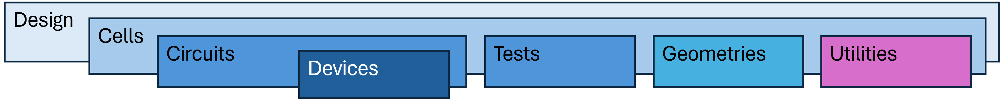
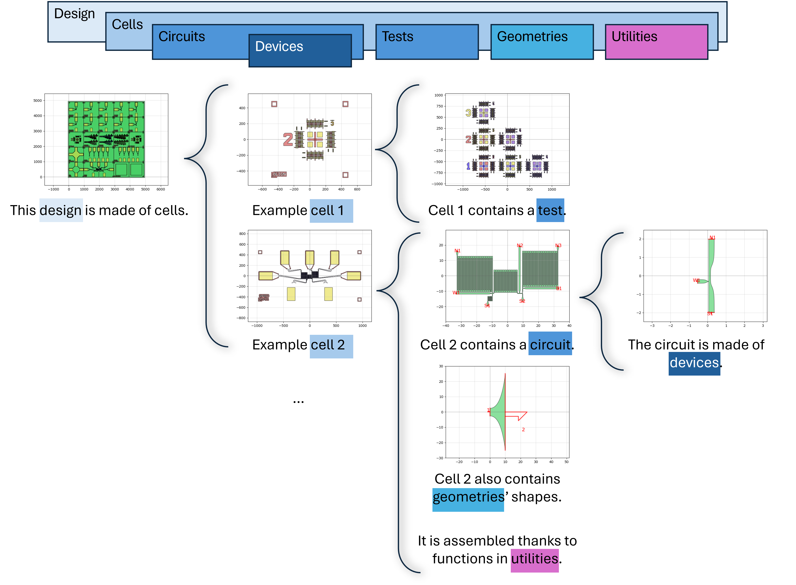

# QNNGDS

## Description
QNNGDS is a toolbox built on top of phidl for device design in the QNN group.

The package is built so that any person wanting to create a new design can do it
easily and quickly. It offers various devices, circuits, and test structures
used and designed in the [QNN group](https://qnn-rle.mit.edu/). The package
hierarchy is thought as follows:

- **Design**: contains classes from which a complete design can be built. The class
  inputs are the basic parameters of the chip. Its methods are pre-built cells
  and tools for distributing and managing the cells over the chip.

  - **Cells**: is a library of cells pre-built, that are called by the Design's
    classes. Each cell contains a text, border marks and an experiment
    (circuits, devices, or tests) connected to pads for external connection.

    - **Circuits**: is a library of circuits made of devices.

      - **Devices**: is a library of basic devices like nTron, hTron, nanowires, resistors etc...

    - **Tests**: is a library of test structures that help through the fabrication process and
      characterization.

    - **Geometries**: contains useful shapes/geometries that are not available in
      Phidl or has been adapted from it for special use cases.

    - **Utilities**: contains useful tools for building cells and circuits.

Below is an example of the modules used to build a design.

## Getting Started
### Installing
- Make sure [gdspy](https://pypi.org/project/gdspy/) is installed
- Install qnngds package with 'pip install qnngds'

### Dependencies
- [phidl](https://pypi.org/project/phidl/)
- [scipy](https://pypi.org/project/scipy/)

## License
This project is licensed under the MIT License - see the LICENSE.txt file for details

## [Documentation](https://qnngds.readthedocs.io/en/latest/)
- [API](https://qnngds.readthedocs.io/en/latest/api.html)
- [Tutorials](https://qnngds.readthedocs.io/en/latest/tutorials.html)

## How to contribute
- [Developer's documentation](https://qnngds-dev.readthedocs.io/en/latest)
