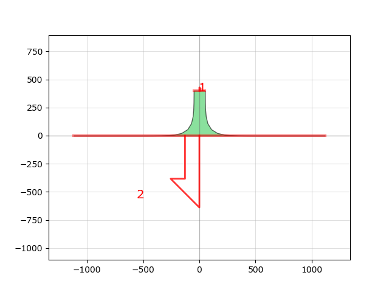

Libraries
=========

Circuits
========

.. image:: ../images/Circuits/snspd_ntron.png
   :alt: snspd_ntron.png

Design
======

.. image:: ../images/Design/create_alignement_cell.png
   :alt: create_alignement_cell.png

.. image:: ../images/Design/create_etch_test_cell.png
   :alt: create_etch_test_cell.png

.. image:: ../images/Design/create_nanowires_cell.png
   :alt: create_nanowires_cell.png

.. image:: ../images/Design/create_ntron_cell.png
   :alt: create_ntron_cell.png

.. image:: ../images/Design/create_resolution_test_cell.png
   :alt: create_resolution_test_cell.png

.. image:: ../images/Design/create_snspd_ntron_cell.png
   :alt: create_snspd_ntron_cell.png

.. image:: ../images/Design/create_vdp_cell.png
   :alt: create_vdp_cell.png

.. image:: ../images/Design/devices map.txt
   :alt: devices map.txt

Devices
=======

.. image:: ../images/Devices/nanowire.png
   :alt: nanowire.png

.. image:: ../images/Devices/nTron.png
   :alt: nTron.png

.. image:: ../images/Devices/ntron_compassPorts.png
   :alt: ntron_compassPorts.png

.. image:: ../images/Devices/ntron_sharp.png
   :alt: ntron_sharp.png

Geometries
==========

.. image:: ../images/Geometries/alignement_mark.png
   :alt: alignement_mark.png

.. image:: ../images/Geometries/hyper_taper.png
   :alt: hyper_taper.png

.. image:: ../images/Geometries/resolution_test.png
   :alt: resolution_test.png

