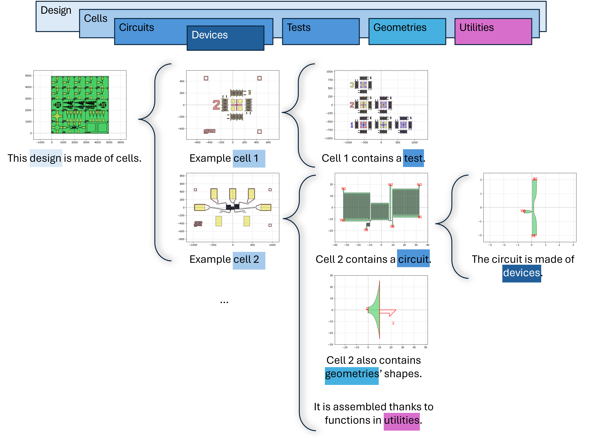

Welcome to qnngds documentation!
===================================

``qnngds`` is a toolbox built on top of phidl for device design in the `QNN
group <https://qnn-rle.mit.edu/>`_. It is made for helping in the design of gds
files.

.. note::

   This project is under active development.

General description
-------------------

The package is built so that any person wanting to create a new design can do it
easily and quickly. It offers various devices and test structures used and designed
in the `QNN group <https://qnn-rle.mit.edu/>`_.

* :ref:`pdk`: Utilities for mapping layouts to a specific fabrication process.
* :ref:`sample`: Contains utilities for placement of finished experiments on a sample.
  Composition of samples enables definition of large samples (e.g. wafers) comprised of
  multiple, smaller samples (e.g. 10 mm pieces) that each may have one or more experiments
  on them.

   * :ref:`experiment`: Provides utilities for converting a process-agnostic layout into an
     experiment that can be placed on a sample. Uses process-specific information specified
     by the :ref:`Pdk`. Can be constructed from circuits or devices.

      * :ref:`devices`: is a library of basic devices like nTron, hTron, nanowires, resistors etc...

      * :ref:`test_structures`: is a library of test structures that help through the fabrication process and
        characterization.

      * :ref:`geometries`: contains useful shapes/geometries that are not available in
        Phidl or has been adapted from it for special use case.

      * :ref:`utilities`: contains useful tools for building cells and circuits.

Below is an example of the modules used to build a design.

Contents
--------

.. toctree::
   :maxdepth: 2

   index
   api
   tutorials

.. _Want to contribute?:

Want to contribute?
-------------------

Access the `qnngds developer documentation <https://qnngds-dev.readthedocs.io/en/latest/>`_.

.. toctree::
   :hidden:

   Developer Documentation <https://qnngds-dev.readthedocs.io/en/latest/>
