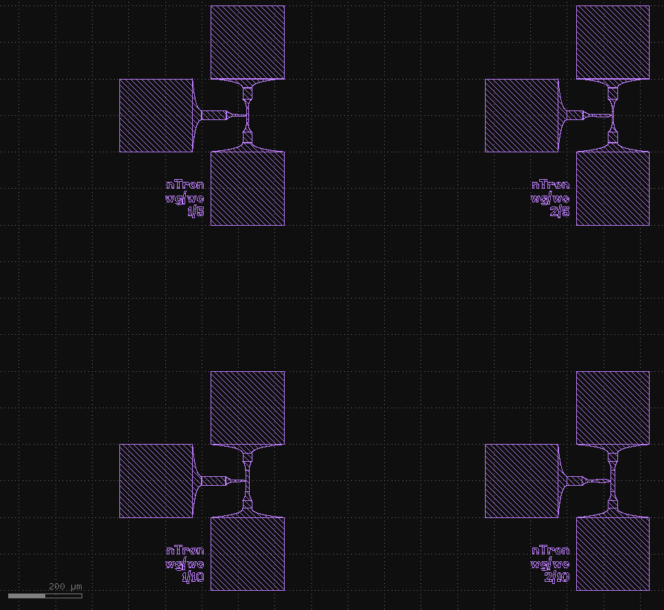
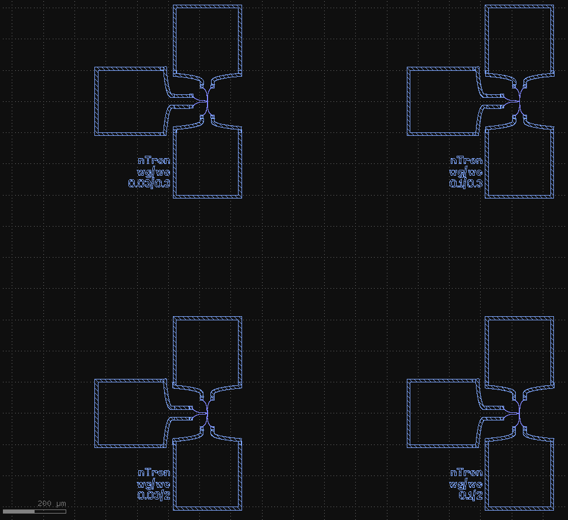
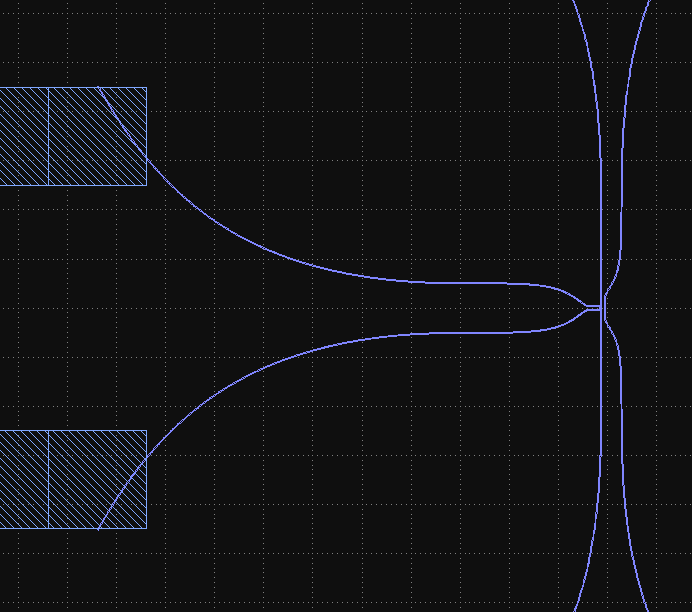

Getting started
===============

Clone boilerplate PDK
------------
* Create a repository on github for your layouts using the template `qnngds-pdk <https://github.com/qnngroup/qnngds-pdk>`_.

* Clone the repository to your machine. The cloned directory will contain everything related to your new design
  (python files, gds files, notes).

Setup a virtual environment and install ``qnngds``
--------------------
* Navigate to the directory you cloned the repository to.

* Create a new virtual environment:

    * Using ``uv`` (recommended, `installation instructions <https://docs.astral.sh/uv/#installation>`_):

        * Open a terminal in the directory you want to put your virtual environment.

        * Execute:

          .. code-block:: bash

              uv venv --python 3.11

        * Follow the instructions from ``uv`` to activate the environment, as they will differ depending on the platform.

        * Install qnngds

    * Using ``conda`` (recommended, `miniforge installation instructions <https://github.com/conda-forge/miniforge?tab=readme-ov-file#install>`_):

        * Execute:

          .. code-block:: bash

              conda create -n my-project-env
              conda activate my-project-env

    * Using ``python``:

        * Open a terminal in the directory you want to put your virtual environment.

        * Execute:

          .. code-block:: powershell

              # windows
              python -m venv .venv/your-env-name
              .\.venv\your-env-name\Scripts\Activate

          .. code-block:: bash

              # Unix/macOS
              python -m venv .venv/your-env-name
              source .venv/your-env-name/scripts/activate

* Install ``qnngds``

    * Using ``uv``

        .. code-block:: bash

            uv pip install qnngds

    * Using ``conda`` or ``python`` ``venv``:

        .. code-block:: bash

            pip install qnngds

.. note::
    To install a development version of ``qnngds`` that hasn't been released yet, replace the command ``pip install qnngds`` with ``pip install -e /path/to/cloned/copy/of/qnngds``. Note that this is a different path from the PDK repo you cloned earlier.

Install klive and gdsfactory extensions for klayout
~~~~~~~~~~~~~~~~~~~~~

* Follow the instructions from the `gdsfactory docs <https://gdsfactory.github.io/klive>`_ and restart klayout.

Start with the basics
~~~~~~~~~~~~~~~~~~~~~

Create a file in the toplevel of the cloned repository.

Import the necessary packages and activate the PDK

.. code-block:: python
    :linenos:

    from pdk import PDK
    from pdk.components import *

    import qnngds as qg
    import gdsfactory as gf

    PDK.activate()

Now let's generate a few different nTron geometries and connect them up to pads.
We'll make use of the ``pad_ntron`` pad layout and ``pad_stack`` defined in the custom PDK.

.. code-block:: python
    :linenos:
    :lineno-start: 8

    nTrons = []
    for choke_w in [1, 2]:
        for channel_w in [5, 10]:
            # create our nTrons
            gate_w = 2 * choke_w
            smooth_ntron = qg.devices.ntron.smooth(
                choke_w=choke_w,
                gate_w=gate_w,
                channel_w=channel_w,
                source_w=max(2, channel_w + 0.1),
                drain_w=max(2, channel_w + 0.1),
                choke_shift=0.0,
                layer="NTRON_COARSE",
            )
            # extend the gate port with an optimal step since it's very small
            dut = gf.components.extend_ports(
                component=smooth_ntron,
                port_names="g",
                extension=partial(
                    qg.geometries.optimal_step,
                    start_width=gate_w,
                    end_width=5,
                    num_pts=200,
                    symmetric=True,
                    layer="NTRON_COARSE",
                ),
            )
            # generate an experiment: a gf.Component with pads, routing between
            # DUT and pads, and a text label
            label = f"nTron\nwg/wc\n{choke_w}/{channel_w}"
            nTrons.append(
                qg.utilities.generate_experiment(
                    dut=dut,
                    pad_array=pad_ntron(
                        pad_spec=pad_stack(layers=["NTRON_COARSE"]),
                        yspace=200,
                        xspace=150
                    ),
                    label=gf.components.texts.text(
                        label, size=25, layer="NTRON_COARSE", justify="right"
                    ),
                    # if route_groups is None, then all ports on the DUT
                    # will be automatically paired with a port on the pad_array
                    # component and routed using a cross section that matches
                    # the layer of the corresponding pad.
                    route_groups=None,
                    dut_offset=(0, 0),
                    pad_offset=(0, 0),
                    # offset text label
                    label_offset=(-120, -200),
                    # how many times to try sbend routing if regular routing
                    # fails
                    retries=1,
                )
            )

    # create a 10 x 10 cm piece and place the nTrons on it
    tron_sample = qg.sample.Sample(
        cell_size=1e3,
        sample=qg.sample.piece10mm,
        edge_exclusion=1e3, # don't place within 1 mm of edge
        allow_cell_span=True,
    )
    tron_sample.place_multiple_on_sample(
        components=nTrons,
        # place only in 2x2 square in top-left
        cell_coordinate_bbox=((0, 0), (1, 1)),
        # place in column-major order
        column_major=True,
    )
    # plot it
    tron_sample.components.show()

Positive-tone ebeam layouts
~~~~~~~~~~~~~~~~~~~~~~~~~~~

Now, let's configure the layers to use positive tone and make the nTron smaller.
We'll split the design into two layers, one for the device (to be written with a low beam current),
and one for the pads (to be written at a high beam current).
We'll use 200 nm line width for the low-current (fine) layer, and 5 μm for the high-current (coarse) layer.
Edit the class method ``outline`` in ``pdk/layer_map.py``.

Rewrite ``outline`` so that it looks like this (adding the layers ``EBEAM_FINE`` and ``EBEAM_COARSE`` if needed):

.. code-block:: python

    @classmethod
    def outline(cls, layer: Layer) -> int:
        """Used to define desired outline for positive tone layers.

        To make a layer positive tone, return a non-zero value for it.

        E.g. if you want EBEAM_FINE to be positive tone with an outline
        of 100 nm, then you should define this function to return 0.1
        when passed a value of EBEAM_FINE (either as an enum type, a string
        or tuple that is equivalent to the EBEAM_FINE GDS layer).
        """
        if gf.get_layer(layer) == cls.EBEAM_FINE:
            return 0.2
        elif gf.get_layer(layer) == cls.EBEAM_COARSE:
            return 5
        # by default, assume a layer is negative tone
        return 0

and then modify our python script from before to use these layers

.. code-block:: python
    :linenos:
    :lineno-start: 8

    nTrons = []
    for choke_w in [0.03, 0.1]:
        for channel_w in [0.3, 2]:
            # create our nTrons
            gate_w = 10 * choke_w
            smooth_ntron = qg.devices.ntron.smooth(
                ...
                layer="EBEAM_FINE",
            )
            # extend the gate port with an optimal step since it's very small
            dut = gf.components.extend_ports(
                component=smooth_ntron,
                ...
                extension=partial(
                    qg.geometries.optimal_step,
                    ...
                    layer="EBEAM_FINE",
                ),
            )
            ...
            nTrons.append(
                qg.utilities.generate_experiment(
                    dut=dut,
                    pad_array=pad_ntron(
                        pad_spec=pad_stack(layers=["EBEAM_COARSE"]),
                        ...
                    ),
                    label=gf.components.texts.text(
                        label, size=25, layer="EBEAM_COARSE", justify="right"
                    ),
                    ...
                )
            )

Now we get a nice positive-tone outline!

Note that the taper between the coarse and fine layers is handled automatically by constructing
a hyper taper on the fine layer. This is done by passing a taper function
``fine_to_coarse`` in ``pdk/components.py`` to ``layer_transitions`` defined in ``pdk/pdk.py``
that creates an oversize hyper taper on the fine layer that overlaps a straight on the coarse layer:

