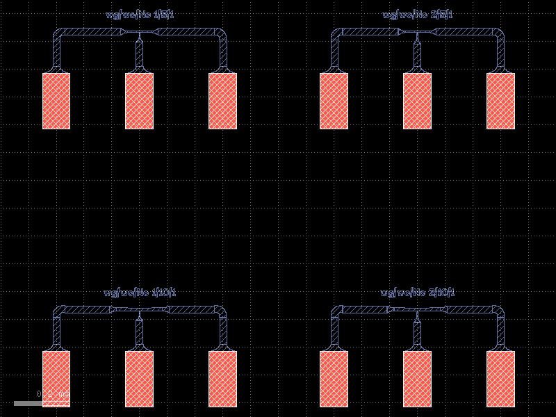

Getting started
===============

Clone boilerplate PDK
------------
* Create a repository on github for your layouts using the template `qnngds-pdk <https://github.com/qnngroup/qnngds-pdk>`_.

* Clone the repository to your machine. The cloned directory will contain everything related to your new design
  (python files, gds files, notes).

Setup a virtual environment and install ``qnngds``
--------------------
* Navigate to the directory you cloned the repository to.

* Create a new virtual environment:

    * Using ``uv`` (recommended, `installation instructions <https://docs.astral.sh/uv/#installation>`_):

        * Open a terminal in the directory you want to put your virtual environment.

        * Execute:

          .. code-block:: bash

              uv venv --python 3.11

        * Follow the instructions from ``uv`` to activate the environment, as they will differ depending on the platform.

        * Install qnngds

    * Using ``conda`` (recommended, `miniforge installation instructions <https://github.com/conda-forge/miniforge?tab=readme-ov-file#install>`_):

        * Execute:

          .. code-block:: bash

              conda create -n my-project-env
              conda activate my-project-env

    * Using ``python``:

        * Open a terminal in the directory you want to put your virtual environment.

        * Execute:

          .. code-block:: powershell

              # windows
              python -m venv .venv/your-env-name
              .\.venv\your-env-name\Scripts\Activate

          .. code-block:: bash

              # Unix/macOS
              python -m venv .venv/your-env-name
              source .venv/your-env-name/scripts/activate

* Install ``qnngds``

    * Using ``uv``

        .. code-block:: bash

            uv pip install qnngds

    * Using ``conda`` or ``python`` ``venv``:

        .. code-block:: bash

            pip install qnngds

.. note::
    To install a development version of ``qnngds`` that hasn't been released yet, replace the command ``pip install qnngds`` with ``pip install -e /path/to/cloned/copy/of/qnngds``. Note that this is a different path from the PDK repo you cloned earlier.

Install klive and gdsfactory extensions for klayout
~~~~~~~~~~~~~~~~~~~~~

* Follow the instructions from the `gdsfactory docs <https://gdsfactory.github.io/klive>`_ and restart klayout.

Start with the basics
~~~~~~~~~~~~~~~~~~~~~

Create a file in the toplevel of the cloned repository.

Import the necessary packages and activate the PDK

.. code-block:: python
    :linenos:

    from pdk import PDK
    from pdk.components import *

    import qnngds as qg
    import gdsfactory as gf

    from functools import partial

    PDK.activate()

Now let's generate a few different nTron geometries and connect them up to pads.
We'll make use of the ``experiment_ntron`` cell from the custom PDK.
See :ref:`Generate Experiment` for examples on setting up custom experiments not already
defined in the PDK (e.g. to use a different pad layout, or for a new device or circuit
not already present in the PDK).

.. code-block:: python
    :linenos:
    :lineno-start: 10

    nTrons = []
    for choke_w in [1, 2]:
        for channel_w in [5, 10]:
            nTrons.append(
                experiment_ntron(
                    choke_w=choke_w, channel_w=channel_w, n_branch=1
                )
            )
    # create a 10 x 10 cm piece and place the nTrons on it
    tron_sample = qg.sample.Sample(
        cell_size=1e3,
        sample=qg.sample.piece10mm,
        edge_exclusion=1e3, # don't place within 1 mm of edge
        allow_cell_span=True,
    )
    tron_sample.place_multiple_on_sample(
        components=nTrons,
        # place only in 2x2 square in top-left
        cell_coordinate_bbox=((0, 0), (1, 1)),
        # place in column-major order
        column_major=True,
    )
    # plot it
    tron_sample.components.show()

