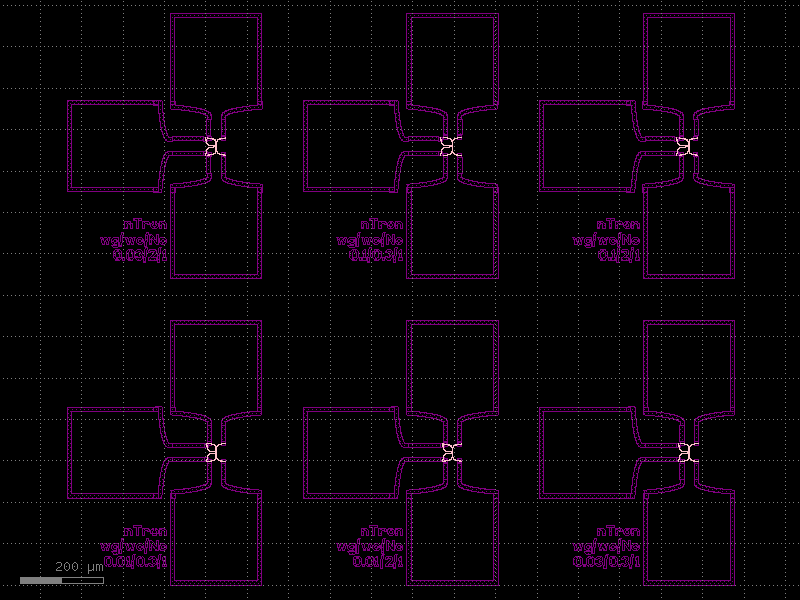

Getting started
===============

Clone boilerplate PDK
------------
* Create a repository on github for your layouts using the template `qnngds-pdk <https://github.com/qnngroup/qnngds-pdk>`_.

* Clone the repository to your machine. The cloned directory will contain everything related to your new design
  (python files, gds files, notes).

Setup a virtual environment and install ``qnngds``
--------------------
* Navigate to the directory you cloned the repository to.

* Create a new virtual environment:

    * Using ``uv`` (recommended, `installation instructions <https://docs.astral.sh/uv/#installation>`_):

        * Open a terminal in the directory you want to put your virtual environment.

        * Execute:

          .. code-block:: bash

              uv venv --python 3.11

        * Follow the instructions from ``uv`` to activate the environment, as they will differ depending on the platform.

        * Install qnngds

          .. code-block:: bash

              uv pip install qnngds

    * Using ``conda`` (recommended, `miniforge installation instructions <https://github.com/conda-forge/miniforge?tab=readme-ov-file#install>`_):

        * Execute:

          .. code-block:: bash

              conda create -n my-project-env
              conda activate my-project-env
              pip install qnngds

    * Using ``python``:

        * Open a terminal in the directory you want to put your virtual environment.

        * Execute:

          .. code-block:: bash

              # windows
              python -m venv .venv/your-env-name
              .\.venv\your-env-name\Scripts\Activate
              pip install qnngds

          .. code-block:: bash

              # Unix/macOS
              python -m venv .venv/your-env-name
              source .\.venv\your-env-name\scripts\activate
              pip install qnngds

Install klive and gdsfactory extensions for klayout
~~~~~~~~~~~~~~~~~~~~~

* Follow the instructions from the `gdsfactory docs <https://gdsfactory.github.io/klive>`_ and restart klayout.

Start with the basics
~~~~~~~~~~~~~~~~~~~~~

Create a file in the toplevel of the cloned repository.

Import the packages.

.. code-block:: python
    :linenos:

    from pdk import PDK
    from pdk.components import *

    import qnngds as qg
    import gdsfactory as gf

    PDK.activate()

Now let's generate a few different nTron geometries and connect them up to pads.
We'll make use of the ``pads_tri`` pad layout defined in the custom PDK.

.. code-block:: python

    :lineno-start: 8

    nTrons = []
    for choke_w in [0.01, 0.03, 0.1]:
        for channel_w in [0.3, 2]:
            # create our nTrons
            gate_w = 10 * choke_w
            smooth_ntron = qg.devices.ntron.smooth(
                choke_w=choke_w,
                gate_w=gate_w,
                channel_w=channel_w,
                source_w=max(2, channel_w + 0.1),
                drain_w=max(2, channel_w + 0.1),
                choke_shift=0.0,
                layer="EBEAM_FINE",
            )
            # extend the gate port with an optimal step
            dut = gf.components.extend_ports(
                component=smooth_ntron,
                port_names="g",
                extension=partial(
                    qg.geometries.optimal_step,
                    start_width=gate_w,
                    end_width=5,
                    num_pts=200,
                    symmetric=True,
                ),
            )
            # generate an experiment: a gf.Component with pads, routing between
            # DUT and pads, and a text label
            label = f"nTron\nwg/wc/Nc\n{choke_w}/{channel_w}/{n_branch}"
            nTrons.append(
                qg.utilities.generate_experiment(
                    # extend gate port with an optimal taper
                    dut=dut,
                    pad_array=pads_tri,
                    label=gf.components.texts.text(
                        label, size=25, layer="EBEAM_COARSE", justify="right"
                    ),
                    route_groups=(
                        # route g,s,d automatically to the closest pad using
                        # the ebeam cross section
                        qg.utilities.RouteGroup(
                            PDK.get_cross_section("ebeam"), ("g", "s", "d")
                        ),
                    ),
                    dut_offset=(0, 0),
                    pad_offset=(0, 0),
                    # offset text label
                    label_offset=(-120, -200),
                    # how many times to try sbend routing if regular routing
                    # fails
                    retries=1,
                )
            )

    # array the nTrons with flex_grid
    c = qg.utilities.flex_grid(nTrons, shape=(2, 3), spacing=(100, 100))
    c.show()

Add test vehicules cells
~~~~~~~~~~~~~~~~~~~~~~~~

Add alignment cells like:

.. code-block:: python
    :lineno-start: 38

    ALIGN_CELL_LEFT = design.alignment_cell(
        layers_to_align = [layers['mgb2_coarse'], layers['pad']], text = 'LEFT'
    )
    design.place_on_chip(ALIGN_CELL_LEFT, (0, 2))

Add Van der Pauw cells like:

.. code-block:: python
    :lineno-start: 48

    VDP_TEST_MGB2 = design.vdp_cell(
        layers_to_probe=[layers["mgb2_coarse"]],
        layers_to_outline=[layers["mgb2_coarse"]],
        text="MGB2",
    )
    design.place_on_chip(VDP_TEST_MGB2, (0, 0))

Add resolution test cells like:

.. code-block:: python
    :lineno-start: 62

    RES_TEST_MGB2_FINE = design.resolution_test_cell(
        layer_to_resolve=layers["mgb2_fine"], text="MGB2 FINE"
    )
    design.place_on_chip(RES_TEST_MGB2_FINE, (2, 2))

Add etch test cell like:

.. code-block:: python
    :lineno-start: 79

    ETCH_TEST = design.etch_test_cell(layers_to_etch=[[layers["pad"]]], text="PAD")
    design.place_on_chip(ETCH_TEST, (3, 0))

.. image:: tutorials_images/tuto_gettingstarted_test_structures.png
   :alt: tuto_gettingstarted_test_structures.png

Some nanowire electronics
~~~~~~~~~~~~~~~~~~~~~~~~~

.. code-block:: python
    :lineno-start: 84

    # SNSPD-NTRON

    SNSPD_NTRON_01 = design.snspd_ntron_cell(w_choke=0.1)
    design.place_on_chip(SNSPD_NTRON_01, (1, 0))

    # NANOWIRES

    channels_w = [0.025, 0.1, 0.5, 1, 2]
    channels_sources_w = [(x, 10 * x) for x in channels_w]
    NANOWIRES = design.nanowires_cell(
        channels_sources_w=channels_sources_w, text="src=10chn"
    )
    design.place_on_chip(NANOWIRES, (1, 1))

    channels_sources_w = [(x, 4 * x) for x in channels_w]
    NANOWIRES = design.nanowires_cell(
        channels_sources_w=channels_sources_w, text="src=4chn"
    )
    design.place_on_chip(NANOWIRES, (3, 1))

    # NTRONS

    remaining_cells = []
    chokes_w = [0.025, 0.05, 0.1, 0.25, 0.5]
    channel_to_choke_ratios = [5, 10]
    for ratio in channel_to_choke_ratios:
        for choke_w in chokes_w:
            channel_w = choke_w * ratio
            NTRON = design.ntron_cell(choke_w, channel_w)
            remaining_cells.append(NTRON)
    design.place_remaining_devices(remaining_cells, write_remaining_devices_map_txt=False)

.. image:: tutorials_images/tuto_gettingstarted_some_electronics.png
   :alt: tuto_gettingstarted_some_electronics.png

Now, let's configure the layers to use positive tone with a different line width for two layers
(representing different beam currents). We'll use 200 nm line width for the low-current layer, and 5 μm for the high-current layer.
Edit the class method ``outline`` in ``pdk/layer_map.py``.

Rewrite ``outline`` so that it looks like this

.. code-block:: python

    @classmethod
    def outline(cls, layer: Layer) -> int:
        """Used to define desired outline for positive tone layers.

        To make a layer positive tone, return a non-zero value for it.

        E.g. if you want EBEAM_FINE to be positive tone with an outline
        of 100 nm, then you should define this function to return 0.1
        when passed a value of EBEAM_FINE (either as an enum type, a string
        or tuple that is equivalent to the EBEAM_FINE GDS layer).
        """
        if gf.get_layer(layer) == cls.EBEAM_FINE:
            return 0.2
        elif gf.get_layer(layer) == cls.EBEAM_COARSE:
            return 5
        # by default, assume a layer is negative tone
        return 0
